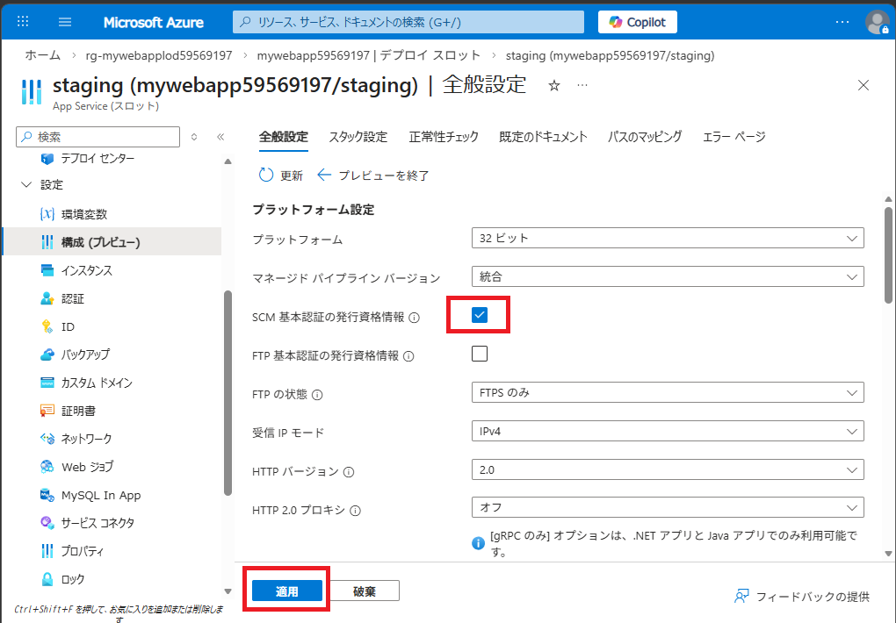

# Azure App Service でデプロイ スロットを交換する


この演習では、静的 HTML Web サイトを Azure App Service にデプロイし、ステージング デプロイ スロットを作成し、コードに変更を加えてステージング スロットにデプロイし、ステージング スロットと運用スロットを交換して、変更を運用環境に昇格させます。安全なアプリケーション更新とブルーグリーンデプロイのためにデプロイスロットを使用する方法を学習します。

この演習で実行されるタスク:

- 静的 HTML Web サイトを Azure App Service にデプロイします。
- ステージング展開スロットを作成します。
- サンプル アプリをダウンロードして ステージング スロットにデプロイします。
- ステージング スロットとデフォルトの実動スロットを入れ替えて、変更を実動スロットに移動します。

この演習は完了するまでに約**20**分かかります。


## 静的 HTML Web サイトを Azure App Service にデプロイする


このセクションでは、コマンドを入力しやすくするための変数を設定し、Azure CLI コマンドを使用して Azure App Service リソースを作成し、静的 HTML サイトをデプロイします。

1. ブラウザーで Azure portal [https://portal.azure.com](https://portal.azure.com/) に移動します。プロンプトが表示されたら、Azure 資格情報を使用してサインインします。

2. ページ上部の検索バーの右側にある **[>_]** ボタンを使用して、Azure portal で新しいクラウド シェルを作成し、***Bash*** 環境を選択します。

   「作業の開始」ウィンドウが表示された場合、以下のように操作します。

   ・「ストレージアカウントは不要です」を選択

   ・「サブスクリプション」をドロップダウンにて選択し「適用」をクリック

   クラウド シェルは、Azure portal の下部にあるウィンドウにコマンド ライン インターフェイスを提供します。

4. 次のコマンドを実行して、リソース グループとアプリ名を保持する変数を設定します。使用するリソースグループがある場合は、**resourceGroup** の **rg-mywebapp** 値を置き換えることができます。コマンドの実行後に表示される **appName** の値をメモしておきます。この値は、この演習の後半で必要になります。

   ※ XXXXXXXXにはLabUser-XXXXXXXXと同じ8桁の数字を入力します。

   ```
   resourceGroup=rg-mywebapplodXXXXXXXX
   
   appName=mywebappXXXXXXXX
   echo $appName
   ```
   
   
   
5. **az webapp up** コマンドを実行します。

   **手記：** このコマンドの実行には数分かかる場合があります。

   ```
   az webapp up -g $resourceGroup -n $appName --sku P0V3 --html
   ```
   
   
   
   デプロイが完了したので、Web アプリを表示します。
   
6. Azure portal で、デプロイした Web アプリに移動します。**[リソース、サービス、ドキュメントの検索 (G + /)]** 検索バーに先ほどメモした名前を入力し、一覧からリソースを選択できます。

7. [**要点**] セクションの [**既定のドメイン]** フィールドにある Web アプリへのリンクを選択します。リンクをクリックすると、サイトが新しいタブで開きます。


## サンプル アプリをデプロイ スロットにデプロイする


このセクションでは、デプロイ スロットを作成し、コードを新しいデプロイ スロットにデプロイします。

### デプロイスロットの作成

1. Azure portal と Cloud Shell のタブに戻ります。

2. クラウドシェルで次のコマンドを入力して、*staging* という名前のデプロイスロットを作成します。

   ```
   az webapp deployment slot create -n $appName -g $resourceGroup --slot staging
   ```

   

3. コマンドが完了するまで待ってから、左側のメニューで **[デプロイ] > [デプロイ スロット**] を選択して、Web アプリのデプロイ スロットを表示します。新しいスロットの名前には、Web アプリの名前に *-staging* が追加されていることに注意してください

4. **mywebappXXXXXXXX-staging** のリンクをクリックし、staging (mywebappXXXXXXXX/staging) のブレードに移動します。

5. 左側のメニューで **[設定] > 構成(プレビュー)**] を選択して、全般設定を表示します。

6.  **[SCM 基本認証の発行資格情報]のチェックボックスをオン** にして、 **[適用]** を選択します。

   


### コードをステージングスロットにデプロイする


1. 次の **git** コマンドを実行して、サンプル アプリ リポジトリの複製を行います。

   ```
   git clone https://github.com/Azure-Samples/html-docs-hello-world.git
   ```

   

2. クラウド シェルで、次のコマンドを実行して、更新されたプロジェクトの zip ファイルを作成します。次のステップでは、zip ファイルまたは Web アプリケーションリソース (WAR) ファイルが必要です。

   ```
   cd html-docs-hello-world
   
   zip -r stagingcode.zip .
   ```

   

3. クラウド シェルで次のコマンドを実行して、更新プログラムをステージング スロットにデプロイします。(もし手順1.で以前のエクスペリエンスに戻った場合は、resourceGroup=userXX および appName=(作成したwebアプリ名)を先に実施する必要があります)

   ```
   az webapp deploy -g $resourceGroup -n $appName --src-path ./stagingcode.zip --slot staging
   ```

   

4. Web アプリの左側のメニューで **[デプロイ] > [デプロイ スロット]** を選択し、前に作成したステージング スロットを選択します。

5. [**要点**] セクションの [**既定のドメイン]** フィールドでリンクを選択します。リンクをクリックすると、ステージングスロットのWebサイトが新しいタブで開きます。


## ステージングスロットと本番スロットを入れ替える


ツールバーの **[スワップ]** オプションを使用して、Azure portal でスワップを実行できます。左側のメニューで [**概要**] または **[展開] > [展開スロット]** を選択すると、ツールバーに [**スワップ]** オプションが表示されます。

1. Azure portal で、左側のメニューで **[デプロイ] > [デプロイ スロット**] を選択して、Web アプリのデプロイ スロットを表示します。

2. ツール バーの **[スワップ(Swap)**] を選択して **[スワップ(Swap)]** パネルを開きます。

3. スワップパネルの設定を確認します。**Source** には **-staging** スロットが表示され、**Target** にはデフォルトの本番スロットが表示されます。

4. **[Start Swap]** を選択し、操作が完了するまで待ちます。ポータルの上部にあるベル アイコンを選択して開くことができる **[通知]** パネルで完了を追跡できます。

5. スワップを確認するには、デプロイした Web アプリに移動します。前に作成した Web アプリ名 (*例: mywebapp12360*) を [**リソース、サービス、ドキュメントの検索] (G + /)** 検索バーに入力し、一覧からリソースを選択します。

6. [**要点**] セクションの **[既定のドメイン]** フィールドにある Web アプリへのリンクを選択します。リンクをクリックすると、サイト (運用スロット) が新しいタブで開きます。

7. 変更を確認し、表示するにはページを更新する必要がある場合があります。

   


## リソースをクリーンアップする

演習が終了したので、不要なリソースの使用を避けるために、作成したクラウド リソースを削除する必要があります。

1. 作成したリソース・グループに移動し、この演習で使用したリソースの内容を表示します。
2. ツール バーで、**リソース グループの削除** を選択します。
3. リソース グループ名を入力し、削除することを確認します。

> **注意：** リソース グループを削除すると、その中に含まれるすべてのリソースが削除されます。この演習で既存のリソース グループを選択した場合、この演習の範囲外の既存のリソースも削除されます。
