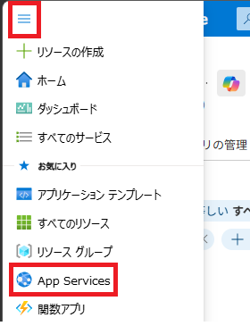

# コンテナー化されたアプリを Azure App Service にデプロイする

この演習では、Microsoft Container Registry からコンテナー イメージを指定して、コンテナー化されたアプリケーションを実行するように構成された Azure App Service Web アプリを作成します。コンテナー設定を構成し、アプリをデプロイし、コンテナー化されたアプリケーションが Azure App Service で正常に実行されていることを確認する方法について説明します。

この演習で実行されるタスク:

- Azure App Service リソースを作成し、コンテナー化されたアプリをデプロイする
- 結果を見る
- リソースをクリーンアップする

この演習は完了するまでに約 **15** 分かかります。

## Web アプリ リソースを作成する

1. ブラウザーで Azure portal [https://portal.azure.com](https://portal.azure.com/) に移動します。プロンプトが表示されたら、Azure 資格情報を使用してサインインします。

2. ホームページの上部近くにある **[Azure サービス**] 見出しにある **[+ リソースの作成**] を選択します。

3. [**マーケットプレイスの検索**] 検索バーに「*Web アプリ*」と入力し、**Enter** キーを押して検索を開始します。

4. Web アプリ タイルで、**作成** ドロップダウンを選択し、**Web アプリ** を選択します。

   

   [**作成**] を選択すると、デプロイに関する情報を入力するためのいくつかのタブを含むテンプレートが開きます。次の手順では、関連するタブで行う変更について説明します。

5. [**基本]** タブに、次の表の情報を入力します

   | 設定                          | アクション                                                   |
   | ----------------------------- | ------------------------------------------------------------ |
   | **リソース グループ           | `rg-WebAppplodXXXXXXXX` を選択します。                       |
   | **名前**                      | **containerwebappXXXXXXXX** を入力します。                   |
   | **名前**設定の下のスライダー  | スライダーを選択してオフにします。                           |
   | **公開**                      | **[コンテナー]** オプションを選択します。                    |
   | **オペレーティング システム** | **Linux** が選択されていることを確認します。                 |
   | **地域**                      | 既定の選択をそのままにするか、近くの地域を選択します。       |
   | **Linuxプラン**               | **新規作成** をクリックし **ASP-rg-WebAppXXXXXXXX** を入力した後、 **OK** をクリックします。 |
   | **料金プラン**                | ドロップダウンを選択し、**Free F1** プランを選択します。     |

   

6. [**コンテナ]** タブを選択または移動し、次の表に情報を入力します。

   | 設定                          | アクション                                           |
   | ----------------------------- | ---------------------------------------------------- |
   | **サイドカーのサポート**      | スライダーは**オフ**の位置に設定する必要があります。 |
   | **画像ソース**                | [**その他のコンテナー レジストリー**] を選択します。 |
   | **アクセスタイプ**            | デフォルトの**パブリック**選択を保持します。         |
   | **レジストリ サーバーの URL** | `mcr.microsoft.com/k8se`　を入力します。             |
   | **画像とタグ**                | `quickstart:latest`　を入力します。                  |
   | **起動コマンド**              | 空白のままにします。                                 |

7. [**確認及び作成**] タブを選択します。

8. 選択した内容を確認し、[**作成**] ボタンを選択します。

デプロイが完了するまでに数分かかる場合があります。完了したら、**リソースに移動** ボタンを選択します。

デプロイが完了したので、Web アプリを表示します。[**Essentials**] セクションの [**既定のドメイン]** フィールドの横にある Web アプリへのリンクを選択します。リンクをクリックすると、サイトが新しいタブで開きます。

> **手記：**デプロイされたコンテナー アプリが実行され、新しいタブに表示されるまでに数分かかる場合があります。

## リソースをクリーンアップする

演習が終了したので、不要なリソースの使用を避けるために、作成したクラウド リソースを削除する必要があります。

1. 作成したリソース・グループに移動し、この演習で使用したリソースの内容を表示します。
2. ツール バーで、**リソース グループの削除** を選択します。
3. リソース グループ名を入力し、削除することを確認します。

> **注意：** リソース グループを削除すると、その中に含まれるすべてのリソースが削除されます。この演習で既存のリソース グループを選択した場合、この演習の範囲外の既存のリソースも削除されます。
