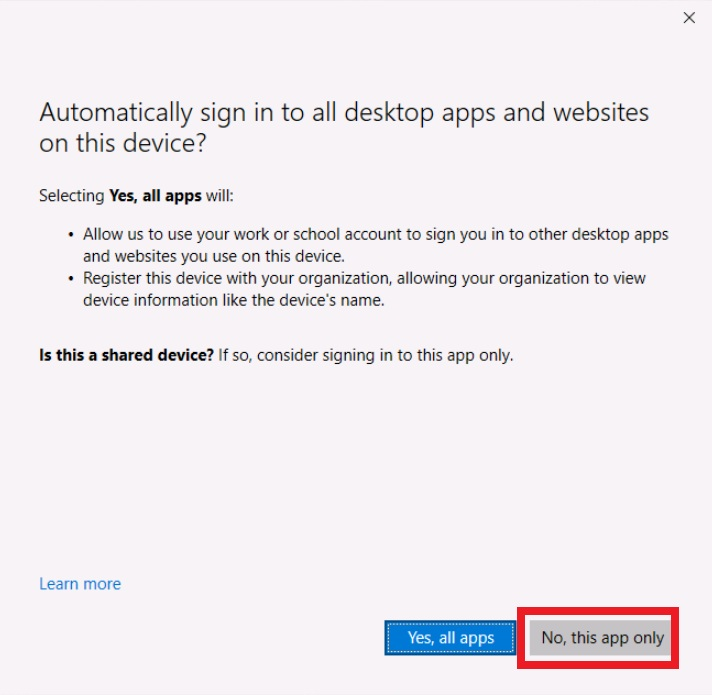

* # Visual Studio Code を使用して Azure 関数を作成する

    
  
    この演習では、HTTP 要求に応答する C# 関数を作成する方法を学習します。Visual Studio Code でローカルにコードを作成してテストした後、Azure で関数をデプロイしてテストします。
    
    この演習で実行されるタスク:
    
    - ローカルプロジェクトを作成する
    - 関数をローカルで実行する
    - Azure で関数をデプロイして実行する
    - リソースをクリーンアップする
    
    この演習は完了するまでに約 **15** 分かかります。
    
    ## 始める前に
    
    
    
    演習を完了するには、次のものが必要です。
    
    - Azure サブスクリプション。まだお持ちでない場合は、[サインアップ](https://azure.microsoft.com/)できます。
    
    - [サポートされているプラットフォーム](https://code.visualstudio.com/docs/supporting/requirements#_platforms)の 1 つ上の [Visual Studio Code](https://code.visualstudio.com/)。
    
    - [.NET 8](https://dotnet.microsoft.com/en-us/download/dotnet/8.0) はターゲット フレームワークです。
    
    - Visual Studio Code 用の [C# 開発キット](https://marketplace.visualstudio.com/items?itemName=ms-dotnettools.csdevkit)。
    
    - Visual Studio Code 用の [Azure Functions 拡張機能](https://marketplace.visualstudio.com/items?itemName=ms-azuretools.vscode-azurefunctions)。
    
    - Azure Functions Core Tools バージョン 4.x。ターミナルで次のコマンドを実行して、システムに Azure Functions Core Tools をインストールします。他のプラットフォームでのインストール手順については、[GitHub の Azure Function Core Tools](https://github.com/Azure/azure-functions-core-tools?tab=readme-ov-file#installing) にアクセスしてください。
    
      ```
      winget uninstall Microsoft.Azure.FunctionsCoreTools
      winget install Microsoft.Azure.FunctionsCoreTools
      ```
    
      
    
      Azure Function Core Tools のインストール中にエラーが発生した場合は、エラー コードに基づいて解決策を検索します。次に、前の手順で **winget install** コマンドを再試行します。


## ローカルプロジェクトを作成する


このセクションでは、Visual Studio Code を使用して、C# でローカルの Azure Functions プロジェクトを作成します。この演習の後半では、関数コードを Azure に発行します。

(事前準備) デスクトップに「Func」という名前のフォルダーを作成してください。

1. Visual Studio Code で、F1 キーを押してコマンド パレットを開き、**Azure Functions: Create New Project...** を検索して実行します。

2. プロジェクト ワークスペースのディレクトリの場所を選択します。Desktopの「Func」フォルダーに移動した後、 **[Select]** を選択します。

3. プロンプトで次の情報を入力します。

   | 指示                                                | アクション                 |
   | --------------------------------------------------- | -------------------------- |
   | Select a language                                   | **[C#**] を選択します。    |
   | Select a .NET runtime                               | **.NET 8.0 Isolated LTS**  |
   | Select a template for your project's first function | **HTTP Trigger**           |
   | Provide a function name                             | `HttpExample `と入力       |
   | Provide a namespace                                 | `My.Function`と入力        |
   | Authorization level                                 | **[Anonymous]** を選択     |
   | How you would like to open your project             | **Open in current window** |

   

4. **[Do you trust the authors of the files in this folder?]** ダイアログで  **[Trust the authers ～]** チェックボックスをオンにして **[Yes, I trust the authers]** をクリックしてください。

   

5. Visual Studio Code は、提供された情報を使用して、HTTP トリガーを使用して Azure Functions プロジェクトを生成します。ローカル プロジェクト ファイルは、エクスプローラーで表示できます。

### 関数をローカルで実行する


Visual Studio Code は Azure Functions Core ツールと統合されているため、Azure に発行する前に、ローカル開発コンピューターでこのプロジェクトを実行できます。

1. ターミナルが Visual Studio Code で開いていることを確認します。ターミナルを開くには、メニューバーで **Terminal** を選択し、次に **New Terminal** を選択します。

2. **F5** キーを押して、デバッガーで関数アプリ プロジェクトを開始します。コアツールからの出力が**Terminal**パネルに表示されます。アプリが**Terminal**パネルで起動します。HTTP トリガー関数の URL エンドポイントがローカルで実行されていることがわかります。

   [](https://github.com/MicrosoftLearning/mslearn-azure-developer/blob/main/instructions/azure-functions/media/01/run-function-local.png)

3. Core Tools を実行した状態で、**Azure** 拡張機能を開きます。拡張機能の [**WorkSpace**] セクションで、 **[Local Project**] > [**Functions**] を展開します。**HttpExample** 関数を右クリックし、 **[Execute Function Now**] を選択します。

   [](https://github.com/MicrosoftLearning/mslearn-azure-developer/blob/main/instructions/azure-functions/media/01/execute-function-local.png)

4. [**Enter Request Body**] に、要求メッセージ本文の値 を入力します。**Enter** キーを押して、この要求メッセージを関数に送信します。関数がローカルで実行され、応答が返されると、Visual Studio Code で通知が発生します。`{ "name": "Azure" }`

   通知ベル アイコンを選択して、通知を表示します。関数の実行に関する情報は**、ターミナル**パネルに表示されます。

   

5. **Shift + F5** キーを押して Core Tools を停止し、デバッガーを切断します。

関数がローカル コンピューターで正しく実行されることを確認したら、Visual Studio Code を使用してプロジェクトを Azure に直接発行します。


## Azure で関数をデプロイして実行する


このセクションでは、Azure Function App リソースを作成し、その関数をリソースにデプロイします。

### Azure にサインインする


アプリを発行する前に、Azure にサインインする必要があります。既にサインインしている場合は、次のセクションに進みます。

1. まだサインインしていない場合は、アクティビティ バーの Azure アイコンを選択し、**Azure: RESOURCES**で **Sign in to Azure を選択します。**

   []

   「The extention 'Azure Resources' wants to sign in using Microsoft」のダイアログが出た場合は **Allow** を選択します。

2. ブラウザーでプロンプトが表示されたら、Azure アカウントを選択し、Azure アカウントの資格情報を使用してサインインします。

   「Automatically sign in ～」のダイアログが出た場合は **NO, this app only** を選択します。

   

3. サインインに成功したら、新しいブラウザーウィンドウを閉じることができます。Azure アカウントに属するサブスクリプションがサイド バーに表示されます。


### Azure でリソースを作成する


このセクションでは、ローカル関数アプリをデプロイするために必要な Azure リソースを作成します。

1. [アクティビティ] バーで [Azure] アイコンを選択し、[**リソース]** 領域で [**リソースの作成...]** ボタンを選択します。

   []

2. プロンプトで次の情報を入力します。

   | プロンプト                                        | アクション                                                   |
   | ------------------------------------------------- | ------------------------------------------------------------ |
   | Select a resource to create                       | **[Create Function App in Azure...] を選択します。**         |
   | Enter a globally unique name for the function app | URL パスで有効な名前を入力します (例: )。入力した名前は、一意であることを確認するために検証されます。**`myfunctionappXXXXXXXX`を入力します。** |
   | Select a location for new resources               | パフォーマンスを向上させるには、お近くの地域(Japan East 等)を選択してください。 |
   | Select a runtime stack                            | **[.NET 8.0 Isolated]** を選択します。                       |
   | Select resource authentication type               | **Secrets** を選択します、                                   |
   
   拡張機能は、ターミナル ウィンドウの **AZURE** 領域で作成されている個々のリソースの状態を表示します。
   
3. 完了すると、関数アプリ名に基づく名前を使用して、次の Azure リソースがサブスクリプションに作成されます。

   - リソースグループ (関連リソースの論理コンテナー) です。
   - プロジェクトに関する状態やその他の情報を保持する標準の Azure Storage アカウント。
   - サーバーレス関数アプリの基になるホストを定義する Flex 従量課金プラン。
   - 関数コードを実行するための環境を提供する関数アプリ。関数アプリを使用すると、関数を論理単位としてグループ化して、同じホスティング プラン内でのリソースの管理、デプロイ、共有を容易にすることができます。
   - 関数アプリに接続された Application Insights インスタンスで、サーバーレス関数の使用状況を追跡します。


### プロジェクトを Azure にデプロイする


> **!重要:** 既存の関数にパブリッシュすると、以前のデプロイメントが上書きされます。

1. コVisual Studio Code で、F1 キーを押してコマンド パレットを開き、 **Azure Functions: Deploy to Function App...** を検索して実行します。

3. **作成した関数アプリ(myfunctionappXXXXXXXX)を選択します。** 以前のデプロイを上書きするように求められたら、 **[Deploy]** を選択して、関数コードを新しい関数アプリ リソースにデプロイします。

   

4. デプロイが完了したら、[**出力の表示]** を選択して、デプロイ結果の詳細を表示します。通知を見逃した場合は、右下隅にある通知ベルのアイコンを選択して、もう一度表示します。

   [](https://github.com/MicrosoftLearning/mslearn-azure-developer/blob/main/instructions/azure-functions/media/01/function-view-output.png)


### Azure で関数を実行する


1. サイド バーの **[RESOURCES]** 領域に戻り、サブスクリプション、Function App、myfunctionappXXXXXXXX、および Functions を展開します。**HttpExample** 関数を**右クリック**し、[**Execute Function Now**...] を選択します。

   [](https://github.com/MicrosoftLearning/mslearn-azure-developer/blob/main/instructions/azure-functions/media/01/execute-function-remote.png)

2. [**Request Body**] に、要求メッセージ本文の値 が表示されます。Enter キーを押して、この要求メッセージを関数に送信します。`{ "name": "Azure" }`

3. 関数が Azure で実行され、応答が返されると、Visual Studio Code で通知が発生します。通知ベル アイコンを選択して、通知を表示します。

   

   

