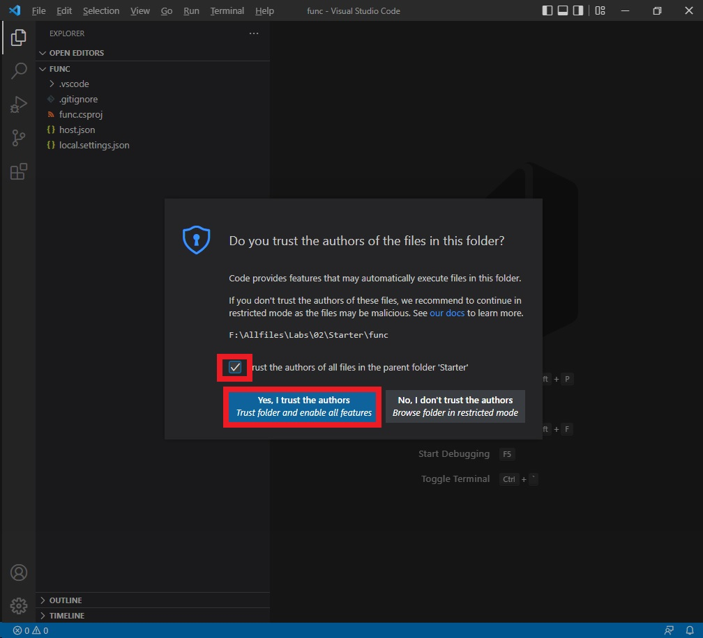

# MSAL.NET を使用した対話型認証の実装


この演習では、Microsoft Entra ID にアプリケーションを登録し、MSAL.NET を使用して対話型認証を実行し、Microsoft Graph のアクセス トークンを取得する .NET コンソール アプリケーションを作成します。認証スコープの設定方法、ユーザーの同意の処理方法、後続の実行のためにトークンのキャッシュ方法を確認する方法について説明します。

この演習で実行されるタスク:

- Microsoft ID プラットフォームにアプリケーションを登録する
- 認証を構成する **PublicClientApplicationBuilder** クラスを実装する .NET コンソール アプリを作成します。
- **user.read** Microsoft Graph アクセス許可を使用して対話形式でトークンを取得します。

この演習は完了するまでに約 **15** 分かかります。

## 始める前に


演習を完了するには、次のものが必要です。

- Azure サブスクリプション。まだお持ちでない場合は、[サインアップ](https://azure.microsoft.com/)できます。
- [サポートされているプラットフォーム](https://code.visualstudio.com/docs/supporting/requirements#_platforms)の 1 つ上の [Visual Studio Code](https://code.visualstudio.com/)。
- [.NET 8](https://dotnet.microsoft.com/en-us/download/dotnet/8.0) 以降。
- Visual Studio Code 用の [C# 開発キット](https://marketplace.visualstudio.com/items?itemName=ms-dotnettools.csdevkit)。

## 新しいアプリケーションを登録する


1. ブラウザーで Azure portal [https://portal.azure.com](https://portal.azure.com/) に移動します。プロンプトが表示されたら、Azure 資格情報を使用してサインインします。

2. ポータルで、 [**アプリの登録]** を検索して選択します。

3. [**+ 新しい登録**] を選択し、[**アプリケーションの登録]** ページが表示されたら、アプリケーションの登録情報を入力します。

   | 畑                                     | 価値                                                         |
   | -------------------------------------- | ------------------------------------------------------------ |
   | **名前**                               | `myMsalApplication`　と入力します                            |
   | **サポートされているアカウントの種類** | **[この組織ディレクトリ内のアカウントのみ**] を選択します。  |
   | **リダイレクト URI (オプション)**      | [**パブリック クライアント/ネイティブ (モバイルとデスクトップ)]** を選択し、右側のボックスに `http://localhost` と入力します。 |

4. [**登録]** を選択します。Microsoft Entra ID によって一意のアプリケーション (クライアント) ID がアプリに割り当てられ、アプリケーションの [**概要**] ページが表示されます。

5. [**概要**] ページの **[Essentials**] セクションに、**アプリケーション (クライアント) ID** と**ディレクトリ (テナント) ID** を記録します。この情報は、アプリケーションに必要です。

   


## トークンを取得するための .NET コンソール アプリを作成する


必要なリソースが Azure にデプロイされたので、次の手順はコンソール アプリケーションを設定することです。次の手順は、ローカル環境で実行されます。

1. ラボWindows環境のデスクトップに **authapp** という名前のフォルダーを作成します。

2. **Visual Studio Code** を起動し、**[FIle] > [Open Folder...]** を選択し、上記の フォルダーを選択し、 **[Select Folder]** をクリックします。

3. **[Do you trust the authors of the files in this folder?]** ダイアログで  **[Trust the authers ～]** チェックボックスをオンにして **[Yes, I trust the authers]** をクリックしてください。

   

4. 上のメニューで **Terminal>New Terminal** を選択してターミナルを開きます。

5. VS Code ターミナルで次のコマンドを実行して、.NET コンソール アプリケーションを作成します。

   ```
   dotnet new console
   ```

   

6. 次のコマンドを実行して、**Microsoft.Identity.Client** パッケージと **dotenv.net** パッケージをプロジェクトに追加します。

   ```
   dotnet add package Microsoft.Identity.Client
   dotnet add package dotenv.net
   ```

   

### コンソール アプリケーションの構成


このセクションでは、前に記録したシークレットを保持する **.env** ファイルを作成および編集します。

1. 上のメニューで **[File] > [New FIle...]** を選択し、プロジェクト フォルダーに *.env* という名前のファイルを作成します。

2. **.env** ファイルを開き、次のコードを追加します。**YOUR_CLIENT_ID**を置き換え、**YOUR_TENANT_ID**前に記録した値に置き換えます。

   ```
   CLIENT_ID="YOUR_CLIENT_ID"
   TENANT_ID="YOUR_TENANT_ID"
   ```

   

3. **ctrl+s** を押して変更を保存します。

### プロジェクトのスターターコードを追加する


1. *Program.cs* ファイルを開き、既存のコンテンツを次のコードに置き換えます。コード内のコメントを必ず確認してください。

   ```
   using Microsoft.Identity.Client;
   using dotenv.net;
   
   // Load environment variables from .env file
   DotEnv.Load();
   var envVars = DotEnv.Read();
   
   // Retrieve Azure AD Application ID and tenant ID from environment variables
   string _clientId = envVars["CLIENT_ID"];
   string _tenantId = envVars["TENANT_ID"];
   
   // ADD CODE TO DEFINE SCOPES AND CREATE CLIENT 
   
   
   
   // ADD CODE TO ACQUIRE AN ACCESS TOKEN
   ```

   

2. **ctrl+s** を押して変更を保存します。

   

### アプリケーションを完成させるためのコードを追加します


1. **「ADD CODE TO DEFINE SCOPES AND CREATE CLIENT」**コメントを見つけて、コメントの直後に次のコードを追加します。コード内のコメントを必ず確認してください。

   ```
   // Define the scopes required for authentication
   string[] _scopes = { "User.Read" };
   
   // Build the MSAL public client application with authority and redirect URI
   var app = PublicClientApplicationBuilder.Create(_clientId)
       .WithAuthority(AzureCloudInstance.AzurePublic, _tenantId)
       .WithDefaultRedirectUri()
       .Build();
   ```

   

2. **ADD CODE TO ACQUIRE AN ACCESS TOKEN** コメントを見つけて、コメントの直後に次のコードを追加します。コード内のコメントを必ず確認してください。

   ```
   // Attempt to acquire an access token silently or interactively
   AuthenticationResult result;
   try
   {
       // Try to acquire token silently from cache for the first available account
       var accounts = await app.GetAccountsAsync();
       result = await app.AcquireTokenSilent(_scopes, accounts.FirstOrDefault())
                   .ExecuteAsync();
   }
   catch (MsalUiRequiredException)
   {
       // If silent token acquisition fails, prompt the user interactively
       result = await app.AcquireTokenInteractive(_scopes)
                   .ExecuteAsync();
   }
   
   // Output the acquired access token to the console
   Console.WriteLine($"Access Token:\n{result.AccessToken}");
   ```

   

3. **ctrl+s を押して**ファイルを保存し、**次に ctrl+q** を押してエディターを終了します。

   

## アプリケーションを実行する


アプリが完成したので、次は実行します。

1. 次のコマンドを実行して、アプリケーションを起動します。

   ```
   dotnet run
   ```

   

2. アプリによって既定のブラウザーが開き、認証に使用するアカウントを選択するように求められます。ラボ環境のResourcesタブに記載された Username/Password をそれぞれクリックして、ラボの中に転記して認証します。

3. 登録済みアプリに対して初めて認証する場合は、サインインしてプロファイルを読み取るためのアプリの承認、およびアクセス権を付与したデータへのアクセスを維持するためのアプリの承認を求める [Permissions requested] 通知が届きます。**[Accept]** を選択します。

   

4. コンソールに次の例のような結果(アクセストークン)が表示されます。

   ```
   Access Token:
   eyJ0eXAiOiJKV1QiLCJub25jZSI6IlZF.........
   ```

   

   再びアプリケーションを dotnet run起動すると、[Permissions requested] 通知が受信されないことがわかります。以前に付与したアクセス許可がキャッシュされました。

## 

## リソースをクリーンアップする


演習が終わったので、先ほど作成したアプリ登録を削除する必要があります。

1. Azure portal で、作成したアプリ登録に移動します。
2. ツール バーで、**削除 を選択します**。
