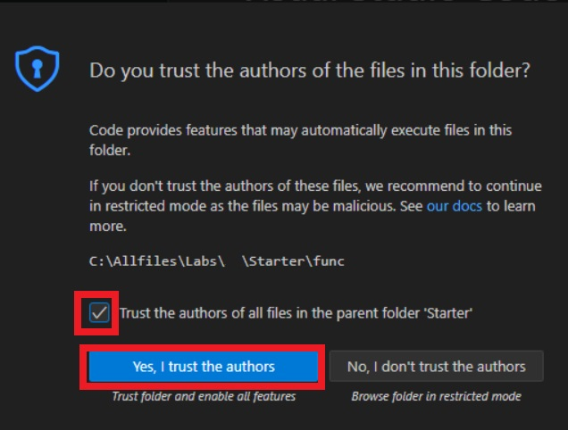

# Microsoft Graph SDK を使用してユーザー プロファイル情報を取得する

 

この演習では、Microsoft Entra ID で認証し、アクセス トークンを要求する .NET アプリを作成し、Microsoft Graph API を呼び出してユーザー プロファイル情報を取得して表示します。アクセス許可を構成し、アプリケーションから Microsoft Graph と対話する方法について説明します。

この演習で実行されるタスク:

- Microsoft ID プラットフォームにアプリケーションを登録する
- 対話型認証を実装し、**GraphServiceClient** クラスを使用してユーザー プロファイル情報を取得する .NET コンソール アプリケーションを作成します。

この演習は完了するまでに約 **15** 分かかります。


## 始める前に


演習を完了するには、次のものが必要です。

- Azure サブスクリプション。まだお持ちでない場合は、[サインアップ](https://azure.microsoft.com/)できます。
- [サポートされているプラットフォーム](https://code.visualstudio.com/docs/supporting/requirements#_platforms)の 1 つ上の [Visual Studio Code](https://code.visualstudio.com/)。
- [.NET 8](https://dotnet.microsoft.com/en-us/download/dotnet/8.0) 以降。
- Visual Studio Code 用の [C# 開発キット](https://marketplace.visualstudio.com/items?itemName=ms-dotnettools.csdevkit)。


## 新しいアプリケーションを登録する


1. ブラウザーで Azure portal [https://portal.azure.com](https://portal.azure.com/) に移動します。プロンプトが表示されたら、Azure 資格情報を使用してサインインします。

2. ポータルで、 [**アプリの登録]** を検索して選択します。

3. [**+ 新しい登録**] を選択し、[**アプリケーションの登録]** ページが表示されたら、アプリケーションの登録情報を入力します。

   | 畑                                     | 価値                                                         |
   | -------------------------------------- | ------------------------------------------------------------ |
   | **名前**                               | `myGraphApplicationXX`　(※ XXにはUserXXと同じ2桁の数字を入力します。)と入力します |
   | **サポートされているアカウントの種類** | **[この組織ディレクトリのみに含まれるアカウント**] を選択します。 |
   | **リダイレクト URI (オプション)**      | ドロップダウンリストで **[パブリック クライアント/ネイティブ (モバイルとデスクトップ)]** を選択し、右側のボックスに `http://localhost` と入力します。 |

4. [**登録]** を選択します。Microsoft Entra ID によって一意のアプリケーション (クライアント) ID がアプリに割り当てられ、アプリケーションの [**概要**] ページが表示されます。

5. [**概要**] ページの **[基本]** セクションに、**アプリケーション (クライアント) ID** と**ディレクトリ (テナント) ID** を記録します。この情報は、アプリケーションに必要です。

   

## メッセージを送受信するための .NET コンソール アプリを作成する


必要なリソースが Azure にデプロイされたので、次の手順はコンソール アプリケーションを設定することです。次の手順は、ローカル環境で実行されます。

1. ラボWindows環境のデスクトップに **graphapp** という名前のフォルダーを作成します。

2. **Visual Studio Code** を起動し、**[File] > [Open Folder...]** を選択し、上記の フォルダーを選択し、 **[Select Folder]** をクリックします。

3. **[Do you trust the authors of the files in this folder?]** ダイアログで  **[Trust the authers ～]** チェックボックスをオンにして **[Yes, I trust the authers]** をクリックしてください。

   

4. 上のメニューで **Terminal>New Terminal** を選択してターミナルを開きます。

5. VS Code ターミナルで次のコマンドを実行して、.NET コンソール アプリケーションを作成します。

   ```
   dotnet new console
   ```

   

6. 次のコマンドを実行して、**Azure.Identity**、**Microsoft.Graph**、**および dotenv.net** パッケージをプロジェクトに追加します。

   ```
   dotnet add package Azure.Identity
   dotnet add package Microsoft.Graph
   dotnet add package dotenv.net
   ```

   

### コンソール アプリケーションの構成


このセクションでは、前に記録したシークレットを保持する **.env** ファイルを作成および編集します。

1. 上のメニューで **[File] > [New File...]** を選択し、プロジェクト フォルダーに *.env* という名前のファイルを作成します。

2. **.env** ファイルを開き、次のコードを追加します。**YOUR_CLIENT_ID**を置き換え、**YOUR_TENANT_ID**前に記録した値に置き換えます。

   ```
   CLIENT_ID="YOUR_CLIENT_ID"
   TENANT_ID="YOUR_TENANT_ID"
   ```

   

3. **ctrl+s** を押して変更を保存します。

   

### プロジェクトのスターターコードを追加する


1. *Program.cs* ファイルを開き、既存のコンテンツを次のコードに置き換えます。コード内のコメントを必ず確認してください。

   ```
   using Microsoft.Graph;
   using Azure.Identity;
   using dotenv.net;
   
   // Load environment variables from .env file (if present)
   DotEnv.Load();
   var envVars = DotEnv.Read();
   
   // Read Azure AD app registration values from environment
   string clientId = envVars["CLIENT_ID"];
   string tenantId = envVars["TENANT_ID"];
   
   // Validate that required environment variables are set
   if (string.IsNullOrEmpty(clientId) || string.IsNullOrEmpty(tenantId))
   {
       Console.WriteLine("Please set CLIENT_ID and TENANT_ID environment variables.");
       return;
   }
   
   // ADD CODE TO DEFINE SCOPE AND CONFIGURE AUTHENTICATION
   
   
   
   // ADD CODE TO CREATE GRAPH CLIENT AND RETRIEVE USER PROFILE
   ```

   

2. **ctrl+s** を押して変更を保存します。

### アプリケーションを完成させるためのコードを追加します


1. **「ADD CODE TO DEFINE SCOPE AND CONFIGURE AUTHENTICATION」** コメントを見つけて、コメントの直後に次のコードを追加します。コード内のコメントを必ず確認してください。

   ```
   // Define the Microsoft Graph permission scopes required by this app
   var scopes = new[] { "User.Read" };
   
   // Configure interactive browser authentication for the user
   var options = new InteractiveBrowserCredentialOptions
   {
       ClientId = clientId, // Azure AD app client ID
       TenantId = tenantId, // Azure AD tenant ID
       RedirectUri = new Uri("http://localhost") // Redirect URI for auth flow
   };
   var credential = new InteractiveBrowserCredential(options);
   ```

   

2. **ADD CODE TO CREATE GRAPH CLIENT と RETRIEVE USER PROFILE** コメントを見つけて、コメントの直後に次のコードを追加します。コード内のコメントを必ず確認してください。

   ```
   // Create a Microsoft Graph client using the credential
   var graphClient = new GraphServiceClient(credential);
   
   // Retrieve and display the user's profile information
   Console.WriteLine("Retrieving user profile...");
   await GetUserProfile(graphClient);
   
   // Function to get and print the signed-in user's profile
   async Task GetUserProfile(GraphServiceClient graphClient)
   {
       try
       {
           // Call Microsoft Graph /me endpoint to get user info
           var me = await graphClient.Me.GetAsync();
           Console.WriteLine($"Display Name: {me?.DisplayName}");
           Console.WriteLine($"Principal Name: {me?.UserPrincipalName}");
           Console.WriteLine($"User Id: {me?.Id}");
       }
       catch (Exception ex)
       {
           // Print any errors encountered during the call
           Console.WriteLine($"Error retrieving profile: {ex.Message}");
       }
   }
   ```

   場合によっては、最後に1つ余計な } が入り、この後のdotnet run でエラーになることがあります。

   該当する場合は削除してください。

   

3. **ctrl+s** を押してファイルを保存します。


## アプリケーションを実行する


アプリが完成したので、次は実行します。

1. 次のコマンドを実行して、アプリケーションを起動します。

   ```
   dotnet run
   ```

   

2. アプリがデフォルトのブラウザーを開き、認証に使用するアカウントを選択するように求めます。複数のアカウントが一覧表示されている場合は、アプリで使用されているテナントに関連付けられているアカウントを選択します。

3. 登録済みアプリに対して初めて認証する場合は、サインインしてプロファイルを読み取るためのアプリの承認、およびアクセス権を付与したデータへのアクセスを維持するように求める [**アクセス許可要求]** 通知が届きます。**[同意する]** を選択します。

   

4. コンソールに次の例のような結果が表示されます。

   ```
   Retrieving user profile...
   Display Name: <Your account display name>
   Principal Name: <Your principal name>
   User Id: 9f5...
   ```

   

5. 再びアプリケーションを dotnet run を実行して起動すると、[Permissions requested] 通知が表示されなくなったことに気づきます。以前に付与した権限がキャッシュされました。

   

## リソースをクリーンアップする


演習が終わったので、先ほど作成したアプリ登録を削除する必要があります。

1. Azure portal のアプリ登録で、本演習の最初に作成したアプリの画面に移動します。

2. ツール バーで、**削除 を選択します**。

   ※「このアプリケーションを削除するアクセス許可がありません。～」というメッセージで削除できない場合、他の受講者が作成したアプリを削除しようとしている可能性がありますので、確認してください。

   

