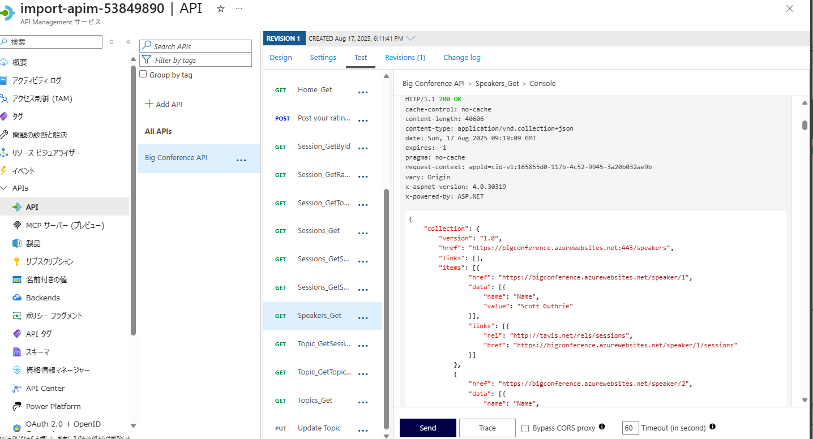

# Azure API Management を使用して API をインポートして構成する

 

この演習では、Azure API Management インスタンスを作成し、OpenAPI 仕様バックエンド API をインポートし、Web サービス URL とサブスクリプション要件などの API 設定を構成し、API 操作をテストして正しく動作することを確認します。

この演習で実行されるタスク:

- Azure API Management (APIM) インスタンスを作成する
- API のインポート
- バックエンド設定を構成する
- API をテストする

この演習は完了するまでに約 **20** 分かかります。


## API Management インスタンスを作成する


演習のこのセクションでは、リソース グループと Azure Storage アカウントを作成します。また、アカウントのエンドポイントとアクセス キーも記録します。

1. ブラウザーで Azure portal [https://portal.azure.com](https://portal.azure.com/) に移動します。プロンプトが表示されたら、Azure 資格情報を使用してサインインします。

2. ページ上部の検索バーの右側にある **[>_]** ボタンを使用して、Azure portal で新しいクラウド シェルを作成し、***Bash*** 環境を選択します。「作業の開始」ウィンドウが表示された場合、以下のように操作します。

   ・「ストレージアカウントは不要です」を選択

   ・「サブスクリプション」をドロップダウンにて選択し「適用」をクリック

   クラウド シェルは、Azure portal の下部にあるウィンドウにコマンド ライン インターフェイスを提供します。

3. CLI コマンドで使用する変数をいくつか作成すると、入力の量が減ります。**myLocation** を前に選択した値に置き換えます。

   ※ XXXXXXXXにはLabUser-XXXXXXXXと同じ8桁の数字を入力します。

   ※ **myEmail** をアクセスできるメール アドレスに置き換えます。

   ```
   myApiName=import-apim-XXXXXXXX
   myLocation=eastus2
   myEmail=myEmail
   ```

   

4. APIM インスタンスを作成します。**az apim create** コマンドを使用して、インスタンスを作成します。

   ※ XXXXXXXXにはLabUser-XXXXXXXXと同じ8桁の数字を入力します。

   ```
   az apim create -n $myApiName \
       --location $myLocation \
       --publisher-email $myEmail  \
       --resource-group myResourceGrouplodXXXXXXXX \
       --publisher-name Import-API-Exercise \
       --sku-name Consumption 
   ```

   

   > **手記：** 操作は約5分で完了するはずです。

## バックエンド API をインポートする


このセクションでは、OpenAPI 仕様のバックエンド API をインポートして公開する方法について説明します。

1. Azure portal で、**API Management サービス**を検索して選択します。

2. [**API Management サービス**] 画面で、作成した API Management インスタンスを選択します。

3. **API Management サービスの**ナビゲーション ウィンドウで、 [**> API]** を選択し、 [**API]** を選択します。

   [](https://github.com/MicrosoftLearning/mslearn-azure-developer/blob/main/instructions/azure-api-mgmt/media/select-apis-navigation-pane.png)

4. **[Create from definition]** セクションで **[OpenAPI**] を選択し、表示されるポップアップで **[Basic/Full]** トグルを **[Full]** に設定します。

   [](https://github.com/MicrosoftLearning/mslearn-azure-developer/blob/main/instructions/azure-api-mgmt/media/create-api.png)

   次の表の値を使用してフォームに入力します。記載されていないフィールドはデフォルト値のままにしておくことができます。

   | 設定                      | 値                                         | 説明                                                         |
   | ------------------------- | ------------------------------------------ | ------------------------------------------------------------ |
   | **OpenAPI specification** | `https://bigconference.azurewebsites.net/` | API を実装するサービスを参照し、リクエストはこのアドレスに転送されます。フォーム内の必要な情報のほとんどは、この値を入力すると自動的に入力されます。 |
   | **URL スキーム**          | [**HTTPS]** を選択します。                 | API によって受け入れられる HTTP プロトコルのセキュリティ レベルを定義します。 |

5. **[Create]** を選択します。


## API 設定を構成する


*Big Conference API* が作成されます。次に、API 設定を構成します。

1. メニューで **[Design]** を選択し、 **[Speakers_Get]** をクリック画面を確認します。
2. メニューで **[Settings]** を選択します。
3. **[Web Service URL]** フィールドに以下の通り入力します。`https://bigconference.azurewebsites.net/`
4. **[Subscription required]** チェックボックスをオフにします。
5. **[Save]** を選択します。


## API をテストする


API がインポートされ、構成されたので、API をテストします。

1. 上の **[Test]** タブを選択します。これにより、API で使用可能なすべての操作が表示されます。

2. **Speakers_Get**操作を検索して選択します。

3. **Send** を選択します。HTTP 応答を表示するには、ページを下にスクロールする必要がある場合があります。

   バックエンドは **200 OK** といくつかのデータで応答します。
   
   (作成直後は不安定で40Xで応答することがあります。
   
    その場合は時間を置くか、ひとまずここまでとしてください。)

　


 ## リソースをクリーンアップする

 

 演習が終了したので、不要なリソースの使用を避けるために、作成したクラウド リソースを削除する必要があります。

1. 作成したリソース・グループに移動し、この演習で使用したリソースの内容を表示します。

2. ツール バーで、**リソース グループの削除** を選択します。

3. リソース グループ名を入力し、削除することを確認します。

   

   **注意：** リソース グループを削除すると、そのグループに含まれるすべてのリソースが削除されます。この演習で既存のリソース グループを選択した場合、この演習の範囲外の既存のリソースも削除されます。
