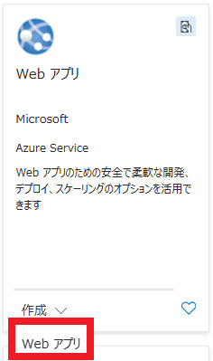

# 自動インストルメンテーションによるアプリケーションの監視


この演習では、Application Insights を有効にして Azure App Service Web アプリを作成し、コードを変更せずに自動インストルメンテーションを構成し、Blazor アプリケーションを作成してデプロイし、Application Insights でアプリケーション メトリックとエラー データを表示します。コードを変更することなく、包括的なアプリケーションの監視と可観測性を実装することで、デプロイと移行が簡単になります。

この演習で実行されるタスク:

- Application Insights を有効にして Web アプリ リソースを作成する
- Web アプリのインストルメンテーションを構成します。
- 新しい Blazor アプリを作成し、それを Web アプリ リソースにデプロイします。
- Application Insights でアプリケーション アクティビティを表示する
- リソースをクリーンアップする

この演習は完了するまでに約 **20** 分かかります。


## Azure でリソースを作成する


1. ブラウザーで Azure portal [https://portal.azure.com](https://portal.azure.com/) に移動します。プロンプトが表示されたら、Azure 資格情報を使用してサインインします。

2. ホームページの上部近くにある **[Azure サービス**] 見出しにある **[+ リソースの作成**] を選択します。

3. [**マーケットプレイスの検索**] 検索バーに「*Web アプリ*」と入力し、**Enter** キーを押して検索を開始します。

   

4. Web アプリ タイルで、**作成** ドロップダウンを選択し、**Web アプリ** を選択します。

5. [**作成**] を選択すると、デプロイに関する情報を入力するためのいくつかのタブを含むテンプレートが開きます。次の手順では、関連するタブで行う変更について説明します。

6. [**基本]** タブに、次の表の情報を入力します。

   | 設定                          | アクション                                                   |
   | ----------------------------- | ------------------------------------------------------------ |
   | **予約**                      | デフォルト値を保持します。                                   |
   | **リソース グループ**         | [新規作成] を選択し、 と入力して [OK] を選択します。必要に応じて、既存のリソース グループを選択することもできます。`rg-WebApp` |
   | **名前**                      | 一意の名前を入力します (**例: YOUR-INITIALS-monitorapp**)。**YOUR-INITIALSを**イニシャルまたはその他の値に置き換えます。名前は一意である必要があるため、いくつかの変更が必要になる場合があります。 |
   | **名前**設定の下のスライダー  | スライダーを選択してオフにします。このスライダーは、一部の Azure 構成でのみ表示されます。 |
   | **著す**                      | [**コード**] オプションを選択します。                        |
   | **ランタイムスタック**        | ドロップダウンメニューで **[.NET 8 (LTS)]** を選択します。   |
   | **オペレーティング システム** | [**Windows**] を選択します。                                 |
   | **地域**                      | 既定の選択をそのままにするか、近くの地域を選択します。       |
   | **Windowsプラン**             | 既定の選択を保持します。                                     |
   | **料金プラン**                | ドロップダウンを選択し、**無料の F1** プランを選択します。   |

7. [**監視 + セキュリティ]** タブを選択または移動し、次の表に情報を入力します。

   | 設定                                  | アクション                                                   |
   | ------------------------------------- | ------------------------------------------------------------ |
   | **Application Insights を有効にする** | [**はい**] を選択します。                                    |
   | **アプリケーションインサイト**        | [**新規作成**] を選択すると、ダイアログ ボックスが表示されます。ダイアログボックスの「**名前**」フィールドに入力します。次に、[**OK**] を選択して名前を受け入れます。`autoinstrument-insights` |
   | **ワークスペース**                    | フィールドがまだ入力されておらず、ロックされていない場合は入力します。`Workspace` |

8. [**確認 + 作成**] を選択し、デプロイの詳細を確認します。次に、 [**作成**] を選択してリソースを作成します。

デプロイが完了するまでに数分かかります。完了したら、**リソースに移動** ボタンを選択します。


### インストルメンテーション設定を構成する


コードを変更せずに監視を有効にするには、サービス レベルでアプリのインストルメンテーションを構成する必要があります。

1. 左側のナビゲーション メニューで、 **[監視]** を展開し、 **[Application Insights**] を選択します。
2. [**アプリケーションのインストルメント化]** セクションを見つけて、 **[.NET Core**] を選択します。
3. [**コレクション レベル]** セクションで **[推奨]** を選択します。
4. [**適用]** を選択し、変更を確認します。
5. 左側のナビゲーション メニューで、[**概要**] を選択します。

## Blazor アプリを作成してデプロイする


演習のこのセクションでは、Cloud Shell で Blazor アプリを作成し、作成した Web アプリにデプロイします。このセクションのすべての手順は、Cloud Shell で実行されます。

1. ページ上部の検索バーの右側にある **[>_]** ボタンを使用して、Azure portal で新しいクラウド シェルを作成し、***Bash*** 環境を選択します。クラウド シェルは、Azure portal の下部にあるウィンドウにコマンド ライン インターフェイスを提供します。

   > **注**: *PowerShell* 環境を使用するクラウド シェルを以前に作成した場合は、***Bash*** に切り替えます。

2. 次のコマンドを実行して、Blazor アプリのディレクトリを作成し、そのディレクトリに変更します。

   ```
   mkdir blazor
   cd blazor
   ```

   

3. 次のコマンドを実行して、フォルダーに新しい Blazor アプリを作成します。

   ```
   dotnet new blazor
   ```

   

4. 次のコマンドを実行してアプリケーションをビルドし、作成中に問題がなかったことを確認します。

   ```
   dotnet build
   ```

   

### アプリを App Service にデプロイする


アプリをデプロイするには、まず **dotnet publish** コマンドを使用してアプリを発行し、次にデプロイ用の*.zip* ファイルを作成する必要があります。

1. 次のコマンドを実行して、アプリを*発行*ディレクトリに発行します。

   ```
   dotnet publish -c Release -o ./publish
   ```

   

2. 次のコマンドを実行して、公開されたアプリの*.zip*ファイルを作成します。*.zip*ファイルは、アプリケーションのルートディレクトリに配置されます。

   ```
   cd publish
   zip -r ../app.zip .
   cd ..
   ```

   

3. 次のコマンドを実行して、アプリを App Service にデプロイします。**YOUR-WEB-APP-NAME** と **YOUR-RESOURCE-GROUP** を、演習の前半で App Service リソースを作成するときに使用した値に置き換えます。

   ```
   az webapp deploy --name YOUR-WEB-APP-NAME \
       --resource-group YOUR-RESOURCE-GROUP \
       --src-path ./app.zip
   ```

   

4. デプロイが完了したら、[**Essentials**] セクションにある **[既定のドメイン]** フィールドのリンクを選択して、ブラウザーの新しいタブでアプリを開きます。

次に、Application Insights でいくつかの基本的なアプリケーション メトリックを表示します。このタブを閉じないでください、演習の残りの部分で使用します。

## Application Insights でメトリックを表示する


Azure Portal でタブを戻し、前に作成した Application Insights リソースに移動します。[**概要**] タブには、いくつかの基本的なグラフが表示されます。

- 失敗した要求
- サーバーの応答時間
- サーバー要求
- 可用性

このセクションでは、Web アプリでいくつかのアクションを実行し、このページに戻ってアクティビティを表示します。アクティビティレポートは遅延するため、グラフに表示されるまでに数分かかる場合があります。

Web アプリで次の手順を実行します。

1. Web アプリのメニューの [**ホーム**]、[**+ カウンター**]、および **[天気]** ナビゲーション オプション間を移動します。
2. Web ページを数回更新して、**サーバーの応答時間**と**サーバー要求**データを生成します。
3. エラーを作成するには、[**ホーム**] ボタンを選択し、URL に **/failures** を追加します。このルートは Web アプリに存在しないため、エラーが生成されます。ページを数回更新して、エラー データを生成します。
4. Application Insights が実行されているタブに戻り、グラフに情報が表示されるまで 1 分か 2 分待ちます。
5. 左側のナビゲーションで、[**調査]** セクションを展開し、[**エラー]** を選択します。失敗した要求数と、失敗の応答コードに関する詳細情報が表示されます。

他のレポート オプションを調べて、他にどのような種類の情報が利用可能かを把握します。


 ## リソースをクリーンアップする

 

 演習が終了したので、不要なリソースの使用を避けるために、作成したクラウド リソースを削除する必要があります。

1. 作成したリソース・グループに移動し、この演習で使用したリソースの内容を表示します。

2. ツール バーで、**リソース グループの削除** を選択します。

3. リソース グループ名を入力し、削除することを確認します。

   

   **注意：** リソース グループを削除すると、そのグループに含まれるすべてのリソースが削除されます。この演習で既存のリソース グループを選択した場合、この演習の範囲外の既存のリソースも削除されます。

