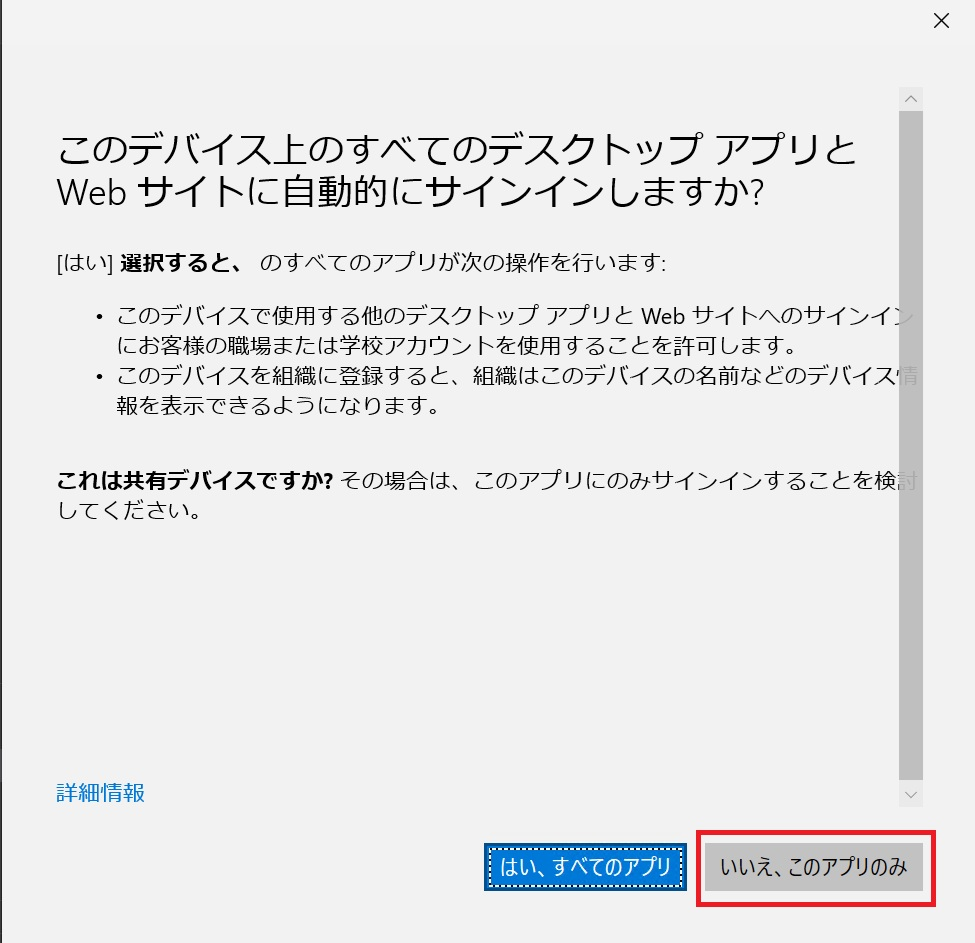
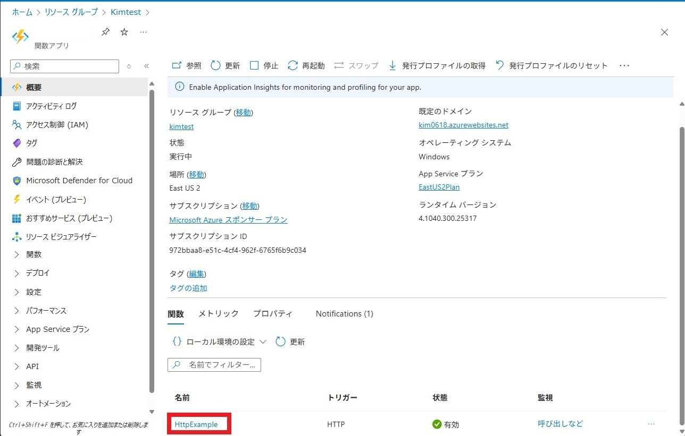

---
lab:
  az204Title: 'Lab 01: Build a web application on Azure platform as a service offerings'
  az204Module: 'Learning Path 01: Implement Azure App Service Web Apps'
---

# ラボ 00: Visual Studio Code を使用して Azure 関数を作成する

## Microsoft Azure ユーザー インターフェイス

Microsoft クラウド ツールの動的な性質を考慮すると、このトレーニング コンテンツの開発の後に発生する Azure UI の変更に気付くかもしれません。 その結果、ラボの指示とラボの手順が正しく整合しなくなる可能性があります。

Microsoft は、コミュニティから必要な変更の通知があったときに、このトレーニング コースを更新します。 ただし、クラウドの更新は頻繁に発生するため、このトレーニング コンテンツの更新の前に UI の変更に気付く可能性があります。 **これが発生した場合は、その変更に適応し、ラボでは必要に応じてそれらに対応してください。**

## Instructions

### 開始する前に

#### ラボ環境にサインインする

次の資格情報を使用して Windows 11 仮想マシン (VM) にサインインします。

- ユーザー名: `localadmin`
- パスワード: `Pa55w.rd1234`

> **注**: 仮想ラボ環境に接続するための手順は、インストラクターから提供されます。

#### インストールされているアプリケーションを確認する

Windows 11 デスクトップでタスク バーを探します。 タスク バーには、このラボで使用する次のようなアプリケーションのアイコンが含まれています。

- Microsoft Edge
- エクスプローラー
- Visual Studio Code

## 課題シナリオ

この演習では、HTTP 要求に応答する C# 関数を作成する方法について学習します。 Visual Studio Code でコードをローカルに作成しテストしたら、その関数を Azure でデプロイしテストします。

この演習で実行されるタスク:

 ローカル プロジェクトを作成する
 関数をローカルで実行する 
 Azure で関数をデプロイして実行する

この演習の所要時間は約 15 分です。


### 演習 1: Visual Studio Code を使用して Azure 関数を作成する

#### タスク 1: ローカル プロジェクトを作成する

1. デスクトップの、 **[Visual Studio Code]** アイコンをダブルクリックして起動します。

1. **[Terminal]** メニューの **[New Terminal]** を選択します。

1. 開いたターミナルの **[Terminal]** タブを選択し、 **[Terminal]** ウィンドウで次のコマンドを実行して必要なパッケージを追加します。

    ```
    cd c:\func
    dotnet nuget add source https://api.nuget.org/v3/index.json -n nuget.org
    ```

1.  **[Terminal]** ウィンドウで次のコマンドを実行し、 .NET 8 プロジェクトを作成します。

    ```
    func init MyFunctionApp --worker-runtime dotnet-isolated --target-framework net8.0
    ```

1.  **[Terminal]** ウィンドウで次のコマンドを実行し、 プロジェクトのフォルダーに移動します。

    ```
    cd MyFunctionApp
    ```

1.  **[Terminal]** ウィンドウで次のコマンドを実行し、 HTTP トリガー関数を追加します。

    ```
    func new --template "HTTP trigger" --name HttpExample
    ```

1.  **[Terminal]** ウィンドウで次のコマンドを実行し、 ビルドとローカル実行できることを確認します。

    ```
    dotnet build
    func start
    ```

1. Windowsセキュリティダイアログが表示されたら **[許可]** をクリックしてください。

    

    

1. ターミナルに緑色で表示された **http://localhost:7071/api/HttpExample をCtrlキーを押しながらクリック** すると、Edgeが起動し、AzureFunctionのローカル実行結果が確認できます。

1. ターミナルのウィンドウをクリックした後、キーボードで **Ctrl + C** を押し、実行をキャンセルします。キャンセルしたため赤いメッセージが出ても気にしないでください。

    

#### タスク 2: プロジェクトを Azure にデプロイする

1. ターミナルで次のコマンドを入力し、プロジェクトのフォルダーに移動します。

    ```
    cd c:\func\MyFunctionApp
    ```

1. ターミナルで次のコマンドを入力し、Enter キーを選択して、Azure CLI にサインインします。

    ```
    az login
    ```

1. **[Microsoft Edge]** ブラウザー ウィンドウで、講師が指示したアカウントのIDとパスワードを入力し、 **[サインイン]** を選択します。「Microsoft account」と「Work or school account」の選択では**「Work or school account」** を選びます。
    サインイン中に以下の画面が出た場合は **[いいえ、このアプリのみ]** を選択します。

    

1. **ターミナル** ウィンドウに戻ります。 以下メッセージが表示されます。

     ----

     The default is marked with an *; the default tenant is 'CTCテクノロジー株式会社' and subscription is 'Microsoft Azure スポンサー プラン' (972bbaa8-e51c-4cf4-962f-6765f6b9c034).

     Select a subscription and tenant (Type a number or Enter for no changes):

     ----

     キーボードで **Enter** を押します。 

1. 次のコマンド（下記の通り変更が必要）を入力してストレージアカウントを作成します。

    ```
    az storage account create --name （ストレージ名） --location eastus2 --resource-group （リソースグループ名） --sku Standard_LRS
    ```

    **（ストレージ名）は一意となる文字列に変更してください。**

    **（リソースグループ名） は講師に確認してください。**

    

1. 次のコマンド（下記の通り変更が必要）を入力して関数アプリを作成します。

   ```
   az functionapp create --resource-group （リソースグループ名） --consumption-plan-location eastus2 --runtime dotnet-isolated --functions-version 4 --name （関数アプリ名） --storage-account （ストレージ名）
   ```

   **（リソースグループ名） は講師に確認してください。**

   **（関数アプリ名）は一意となる文字列に変更してください。ストレージ名と同じでも構いません。**

1. 次のコマンドを入力して、ローカルの関数を公開できるようにビルドします。

   ```
   dotnet publish -c Release
   ```

1. 次のコマンド（下記の通り変更が必要）を入力して関数アプリを作成します。

    ```
    func azure functionapp publish（関数アプリ名） --dotnet-version 8.0
    ```

    **（関数アプリ名）は前の手順で作成したものの名前に変更してください。**

    

#### タスク 3: Azure portal から確認

1. タスク バーで、**Microsoft Edge** アイコンを選択します。

1. ブラウザー ウィンドウで、Azure portal (`https://portal.azure.com`) に移動してから、このラボで使用するアカウントでサインインします。

1. ポータル上部の検索欄にて「関数アプリ」で検索し、関数アプリの画面に移動します。

1. 自分の作成した関数アプリ名のリンクをクリックします。

1. 自分の作成した関数アプリの画面にて、下の方に表示される「HttpExample」のリンクをクリックします。

   

1. 「HttpExample | コードとテスト」画面上部の「関数のURLの取得」ボタンをクリックして表示される関数のURL(3つありますが、どれでも構いません)をコピーします。

   

1. コピーしたURLをブラウザーのアドレスバーに貼り付けてアクセスします。「Welcome to Azure Functions!」と表示されることを確認できたら、演習は終了です。

#### 確認

この演習では、Azure 関数 アプリを作成し、コードをクラウドにデプロイしました。
